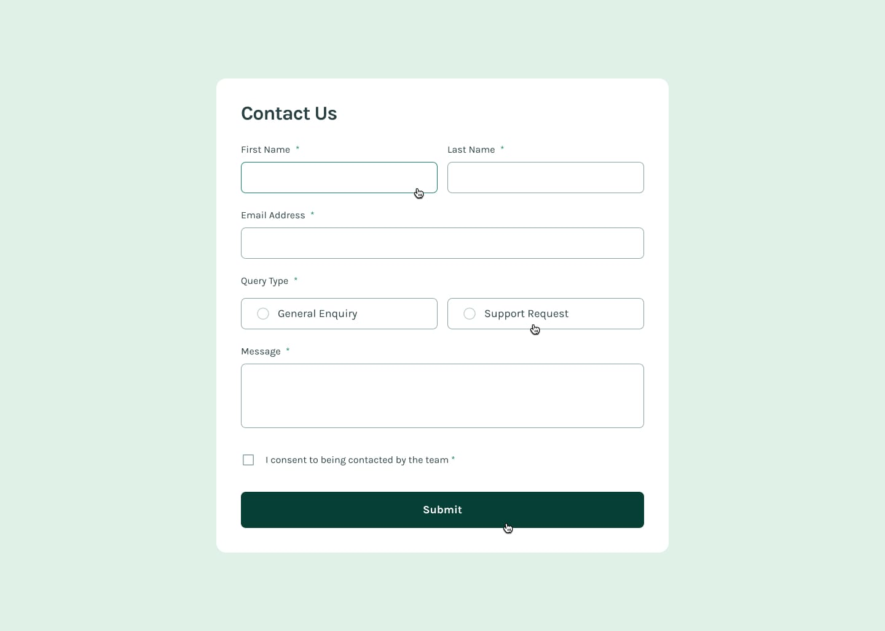

# Frontend Mentor - Contact form solution
This is a solution to the [Contact Form Challenge on Frontend Mentor](https://www.frontendmentor.io/challenges/contact-form--G-hYlqKJj). The challenge focuses on building an accessible and responsive contact form with proper validation and success handling using React and Vite.

## Table of Contents

- [Overview](#overview)
  - [The Challenge](#the-challenge)
  - [Screenshot](#screenshot)
  - [Links](#links)
- [My Process](#my-process)
  - [Built With](#built-with)
  - [What I Learned](#what-i-learned)
  - [Continued Development](#continued-development)
  - [Useful Resources](#useful-resources)
- [Author](#author)
- [Acknowledgments](#acknowledgments)

## Overview

### The Challenge

Users should be able to:

- Complete the form and see a success toast message upon successful submission.
- Receive form validation messages if:
  - A required field has been missed.
  - The email address is not formatted correctly.
- Complete the form only using their keyboard.
- Have inputs, error messages, and the success message announced on their screen reader.
- View the optimal layout for the interface depending on their device's screen size.
- See hover and focus states for all interactive elements on the page.

### Screenshot





### Links

- Solution URL: [GitHub Repository](https://github.com/ezekiel673/contact-form-main)
- Live Site URL: [Live Demo](https://your-live-site-url.com)

## My Process

### Built With

- **React** - For building the user interface.
- **Vite** - For fast development and build processes.
- **HTML5 & CSS3** - Semantic markup and responsive design.
- **Flexbox & CSS Grid** - For layout structuring.
- **Accessible Form Handling** - ARIA attributes and keyboard navigation support.

### What I Learned

Working on this project helped me improve my understanding of:

- Handling form validation with React's state management.
- Implementing accessible forms using ARIA attributes.
- Creating responsive layouts using CSS Grid and Flexbox.
- Using `setTimeout` to auto-hide success messages.
- Providing clear user feedback for errors and success states.

Example code snippet for handling form validation:

```jsx
const validate = () => {
  const newErrors = {};
  if (!formData.firstName.trim()) newErrors.firstName = 'This field is required';
  if (!formData.lastName.trim()) newErrors.lastName = 'This field is required';
  if (!formData.email.trim() || !/\S+@\S+\.\S+/.test(formData.email)) newErrors.email = 'Please enter a valid email address';
  if (!formData.query) newErrors.query = 'Please select a query type';
  if (!formData.message.trim()) newErrors.message = 'This field is required';
  if (!formData.consent) newErrors.consent = 'To submit this form, please consent to being contacted';

  setErrors(newErrors);
  return Object.keys(newErrors).length === 0;
};

```

## Continued Development
- Moving forward, I aim to:

- Improve form accessibility by enhancing screen reader announcements for dynamic changes.

- Implement more advanced validation techniques using external libraries like Formik or React Hook Form.

- Add animations to enhance user experience during form submission and validation.

## Useful Resources
- React Documentation - Official React documentation, which helped me structure the application properly.

- [MDN Web Docs](https://developer.mozilla.org/) - For understanding form attributes and accessibility best practices.

- [WAI-ARIA Authoring Practices](https://www.w3.org/WAI/ARIA/apg/) - Essential resource for implementing accessible forms.

## Author

- Frontend Mentor - [@ezekiel673](https://www.frontendmentor.io/profile/ezekiel673)
- Twitter - [@Adeosun Ezekiel](https://twitter.com/yeshua_codeit)
- Github - [@ezekiel673](https://twitter.com/yeshua_codeit)

## Acknowledgments
- Special thanks to Frontend Mentor for providing this challenge. It was a great opportunity to practice form validation, accessibility, and responsive design in React.